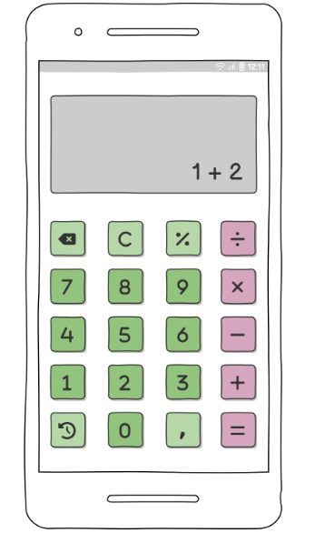

# Trabalho-Programa-o-Mobile

# README

## Requisitos

* O aplicativo deve ter os botões de:
  `0-9`, `+`, `-`, `*`, `/`, `=`, `C`, `%`, `.`, `+/-`
* O aplicativo deve ser capaz de realizar operações matemáticas básicas:
  * Soma
  * Subtração
  * Multiplicação
  * Divisão
* O aplicativo deve ser capaz de realizar operações com números decimais e naturais.
* O aplicativo não deve permitir divisões por zero.
* O aplicativo deve exibir o resultado das operações ao clicar no botão `=`.
* O aplicativo deve ter um botão `C` para resetar as operações, retornando para o número zero.
* O aplicativo deve manter um histórico das operações realizadas.
* O aplicativo deve permitir realizar o cálculo de porcentagem ao apertar o botão `%`.
* O aplicativo deve ter um botão `backspace`.
* O aplicativo deve ter um botão para alterar o sinal do número atual no visor (`+/-`).

